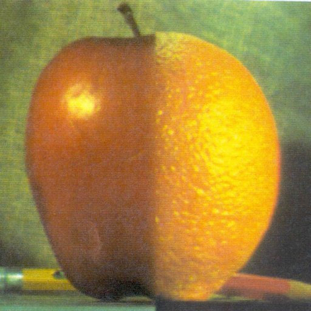
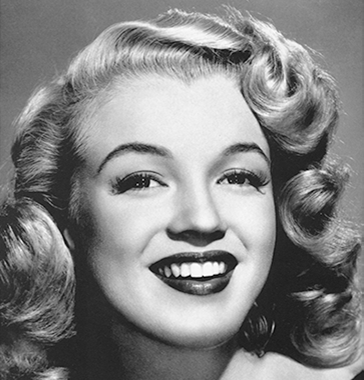

# Hybrid images

With these programs hybrid images of two source images can be generated.

## Blending

The generated image consists of two halves of two images. It is created via three methods.

1. Direct blending (just cutting the images in half)
2. Laplacian blending (using laplace pyramid)
3. Laplacian blending with mask (using laplace pyramid for images and gauss pyramid for the mask)

### Examples

Apple             | Orange
:-------------------------:|:-------------------------:
  |  

### Results

Method             | Image
:-------------------------:|:-------------------------:
Direct  |  
Laplace w/o mask  |  
Laplace w/ mask  |  

## Low-/High-frequency merge
The generated image consists of the low-frequency components of one image and the high-frequency components of the other one.
This results in seeing one or the other image depending on the distance it is looked upon.
If you are closer you see the picture from which the high frequencies have been extracted,
if you increase the distance you see the picture from which the low frequencies have been extracted.

### Examples

Original             |  Low-pass / High-pass (Sigma=10)
:-------------------------:|:-------------------------:
  |  
  |  

Sigma             | Near             |  Far
:-------------------------:|:-------------------------:|:-------------------------:
Low: 10 High: 10  |   |  

Sigma             | Near             |  Far
:-------------------------:|:-------------------------:|:-------------------------:
Low: 10 High: 30  |   |  

Original             |  Low-pass / High-pass (Sigma=10)
:-------------------------:|:-------------------------:
  |  
  |  

Near             |  Far
:-------------------------:|:-------------------------:
  |  
